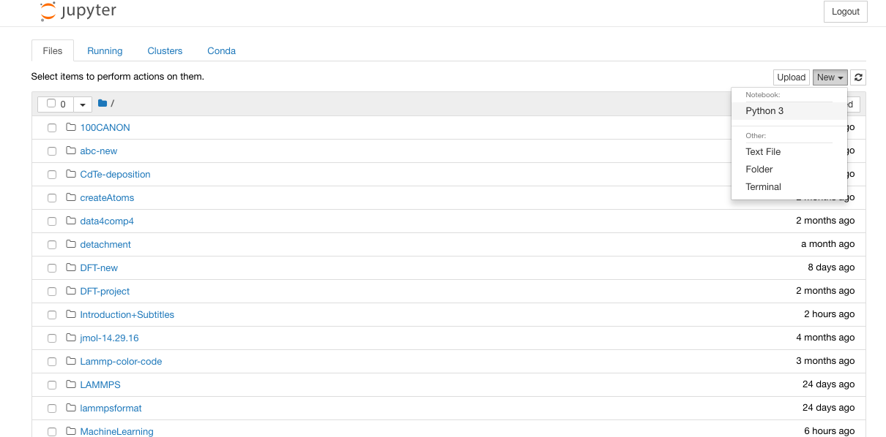

# Jupyter-Tutorial
1. Install [anaconda](https://www.anaconda.com/download) and follow the instructions to install.
2. Open anaconda and click on `launch` in Jupyter notebook, or got to the require directory and type on terminal `jupyter notebook`. 
3. It will display a screen as below . 
3. Click on New >python3 and write the codes as below .

