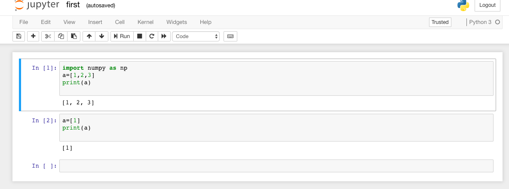
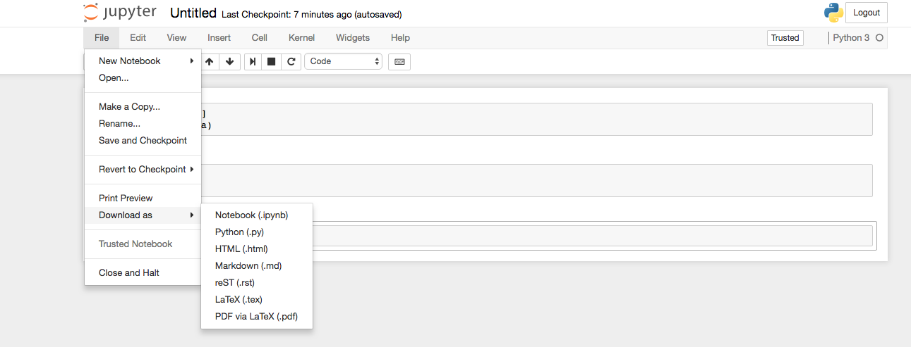

# Jupyter-Tutorial
1. Install [anaconda](https://www.anaconda.com/download) and follow the instructions to install.
2. Open anaconda and click on `launch` in Jupyter notebook, or got to the require directory and type on terminal `jupyter-notebook`. 
3. It will display a screen as below . 
3. Click on New >python3 and write the codes as below .
4. Hit 'return' to give new line for code.
5. In macbook `shift+return` runs the code and gives output.
6. Click on `file > Download as> .ipynb' with appropriate file and save it . 
7. `ctrl+ two time pressing c` cancel the jupyter notebook terminal.
